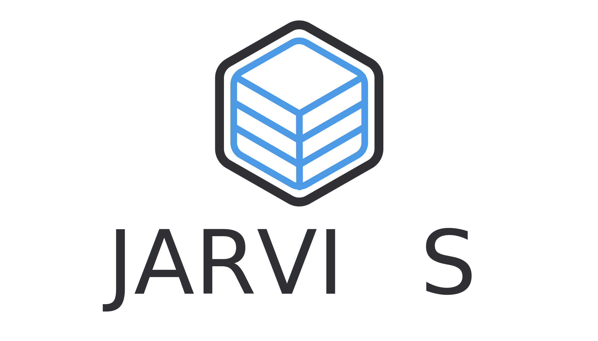

<div align="center">
    
    <h1>Jarvis</h1>
    <p>Quick & easy to set up cloud based media stack</p>
</div>

## 📋 Requirements:
These are the required libraries/packages to run this stack:
 - [Docker](https://docker.com)
 - [Docker Compose](https://docs.docker.com/compose/)

## ⬇️ Installation:
```shell
git clone https://github.com/NuroDev/jarvis.git
```
```shell
cd jarvis/
```

## 🏗 Setup:
Before you can get started, you will need to create the required `.env` file. The best way to do this is to copy the example `.env` file's provided. Run the following commend for both the frontend and the backend:
```
cp example.env .env
```
Once the `.env` file has been copied, open the file in your chosen editor, EG: Vim, Emacs, Nano, etc. When in there, change the required directories to point to your desired locations.
You will also need to enter your domain name and login details for the Transmission VPN in the backend env file.

## 🔧 Configure:
Sadly there are some containers that do require some extra setup to get up and running. All documentation for this can be found [here](https://github.com/NuroDev/jarvis/blob/master/config.md)

## 🚀 Usage:
```
docker-compose up -d
```

## 🔑 Access:
| Container		| URL                    |
| ------------- |:----------------------:|
| Traefik       | `proxy.ip_address`     |
| Heimdall		| `manager.ip_address`   |
| InfluxDB		| `db.ip_address`        |
| Cadvisor		| `cadvisor.ip_address`  |
| Grafana		| `monitoring.ip_address`|
| Plex      	| `plex.ip_address`      |
| Ombi			| `request.ip_address`	 |

## 📄 License:
MIT © [Ben Dixon](https://github.com/NuroDev/jarvis/blob/master/LICENSE)
