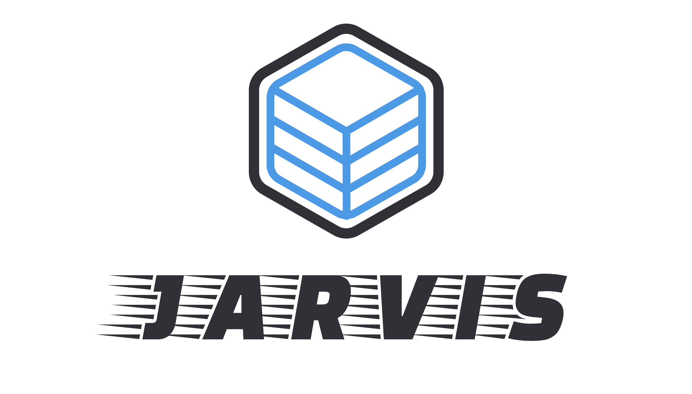

<div align="center">
    
</div>

## 📋 Requirements:
These are the required libraries/packages to run this stack:
 - [Docker](https://docker.com)
 - [Docker Compose](https://docs.docker.com/compose/)

## 🚀 Usage:
```shell
curl -L jarvis.nuro.sh | sh
```

## 🔧 Configure:
Sadly there some things that do need to be configured to set up Jarvis. Most of them will be set up automatically via the install script. However there are a few that will require manual creation.

All documentation for configuring Jarvis, for both manual and automatic details, can be found in the [wiki](https://github.com/NuroDev/jarvis/wiki).

## 🔑 Access:
| Container		| Description                | URL                    | Port        |
| ------------- |:--------------------------:|:----------------------:|:-----------:|
| Cadvisor		| Docker Metrics             | `cadvisor.ip_address`  | `9090`      |
| Grafana		| Monitoring Dashboard       | `monitoring.ip_address`| `3000`      |
| Heimdall		| Stack Manager              | `manager.ip_address`   | `81`        |
| Influx		| Database                   | `db.ip_address`        | `8086`      |
| Ombi			| Content Requesting         | `request.ip_address`   | `3579`      |
| Plex      	| Content Streaming          | `plex.ip_address`      | `32400`     |
| Tautulli      | Plex Metrics               | `tautulli.ip_address`  | `8181`      |
| Traefik       | Reverse Proxy              | `proxy.ip_address`     | `8080`      |

## 📄 License:
MIT © [Ben Dixon](https://github.com/NuroDev/jarvis/blob/master/LICENSE)
